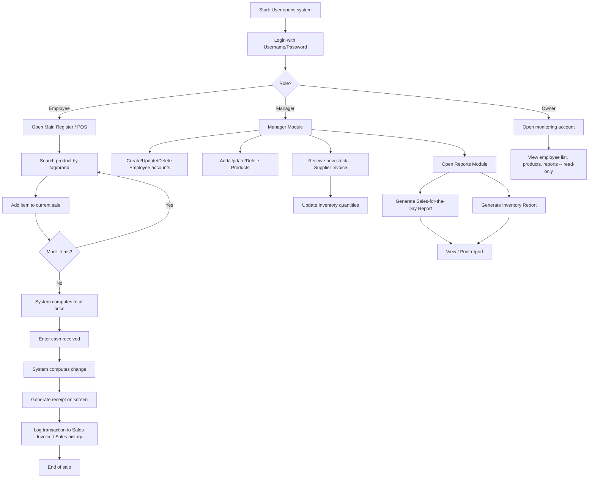
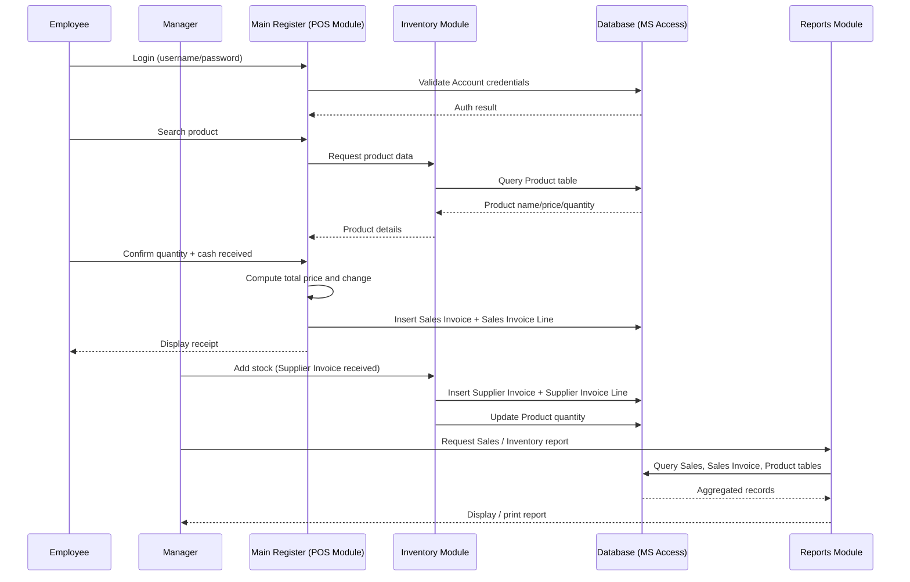

# ChardWorkz — THESIS1 Summary

## 1. Project Overview & Context

THESIS1.docx documents an undergraduate IT capstone proposing a computerized **Point of Sale (POS) and Inventory System** for **AJ Trading Motorparts**, a 20-year-old motorparts shop in Tarlac (with a second branch in San Vicente, Tarlac City) that still runs entirely on manual, paper-based sales and stock recording. The system's objective is to replace calculator-and-logbook transactions and untracked stock counts with a role-based desktop application (Manager, Employee, Owner) covering sales, inventory, employee accounts, and reporting. The proposed build targets a Windows desktop stack (Visual Basic 2010, Microsoft Access) and is scoped strictly to the two named branches, cash-only payments, and no barcode/credit-card support.

## 2. Comprehensive Summary

### Chapter 1 — Introduction
Frames the general shift from manual sales/inventory recording to computerized POS and inventory management, citing IBM as an example of an established vendor in this space, and sets up the case for automating AJ Trading Motorparts' business processes.

### Project Context
- AJ Trading Motorparts (est. ~20 years, two branches: main + San Vicente, Tarlac City) sells motorparts and mechanical services.
- Current process: employee manually looks up product on the shop floor, cross-checks a printed price list, handwrites customer/receipt details, and computes totals with a calculator — roughly **5 minutes per customer**.
- Stock receiving is logged in a manager's notebook (quantity received, notify owner, place on shelf) with **no real-time inventory visibility** — staff rely on visually checking the shelves.
- No existing POS or Inventory System of any kind; 100% paper-based, which the thesis frames as the core problem (illegible/erroneous handwriting, lost records).
- Proposed system: automate sales for both branches and give the manager/admin a reliable, centralized inventory record, replacing the paper system with a secure database.

### Purpose and Description
- Intended to benefit AJ Trading Motorparts management directly and serve as a reference for similar business-IT studies.
- Goals: speed up sales transactions, reduce staff time/effort on record-keeping, and give management/owner a transparent, shared view of sales and inventory data.
- Functionally: product search with automatic price/total computation by quantity; Manager can add/update/delete products and receive stock; Manager can create Employee accounts; system generates sales reports viewable by the Manager for transparency across the business.

### Statement of Objectives
**Primary objective:** develop a "Point of Sale and Inventory System" for AJ Trading Motorparts with four modules:
1. Manager Module
2. Main Register Module (POS/cash register)
3. Inventory Module
4. Reports Module

**Validation objective:** assess system effectiveness with two evaluator groups:
- *IT Experts* — efficiency, information security, database design
- *System Users (Manager, Employee)* — ease of use, system accessibility, accuracy of reports

### Scope and Limitations
- **In scope:** Point-of-Sale, automatic daily sales computation, employee account management, inventory reporting; Manager can add Employee accounts; Main Register acts as POS + cash register (new sale / discard sale, compute total, cash received, change); cash payments only; per-employee sales history logging; product add/update/delete restricted to Manager (with Owner/Employee visibility for transparency); products tagged/branded for searchability; timely, printable Sales-for-the-Day and Inventory reports for logged-in Managers. Deployment is local-only, scoped to the named branches.
- **Out of scope / limitations:** no barcode scanning, no credit-card payments, receipt is display-only (not printed), and no support for returns/exchanges of sold items.

### Definition of Terms
Defines: Accuracy of Reports, Database Design, Ease of Use, Effectiveness of the System, Inventory, POS, Receipt (product, quantity, total price, money rendered, change, customer name, sales ID), System Accessibility.

### Chapter 2 — Review of Related Literature and Studies
- **Foreign literature:** Carolina Barcode Inc. (2013) on POS fundamentals; Stair & Reynolds (*Introduction to Information Systems*) on purchasing/transaction-processing systems; U.S. Small Business Administration (2010) on inventory-management tradeoffs (turnover vs. cost, avoiding over/under-stocking).
- **Local literature:** Gemma Navarro (2012) on computers' role in modern business; Ariel Magat on the institutional importance of proper record safekeeping; Averion, Gaela & Libo (2009) on inventory systems reducing manual counting burden and improving supplier/dealer coordination.
- **Foreign studies:** Carlo Magno and Mike Toland, both cited on the inadequacy of paper/spreadsheet-based tracking versus a database-backed system.
- **Related systems (precedent projects) cited as design/methodology precedent:**
  - Wal-Mart's perpetual inventory system (scan-in at distribution center, POS-driven deduction at sale).
  - Gragasin et al. (2010) — POS & Inventory System for Anespee Enterprise Hardware Carangian.
  - De Leon & Ferrer (2009) — Koread RedGinseng Enterprise Sales and Inventory System.
  - De Alday, Espino & Ragudo (2010) — Computerized Sales and Inventory System for Ronmon Trading.
- Each cited work is paired with a "researchers propose..." note tying the precedent back to a specific design choice adopted for the AJ Trading system (e.g., local database storage, fast searchable reports, reducing manual counting).

### Chapter 3 — Technical Background
Documents the shop's current tools (calculator, sales invoice/paper, pen) versus the proposed system's requirements:

**Software (development environment):**
| Software | Description |
|---|---|
| Windows 8/7 | OS compatible with the development toolchain |
| Visual Basic 2010 | Application builder used to develop the system |
| Microsoft Access | DBMS (Jet Database Engine + GUI + dev tools) |

**Hardware (development/runtime machine):**
| Hardware | Spec |
|---|---|
| Laptop/Desktop | Intel i3 2.7GHz or higher |
| Hard Disk | Min. 1GB free space |
| RAM | 2GB or higher |
| Display | Min. 1366×768 |

**Software (deployment/runtime, Table 4):** Windows 8/7 + Visual Basic 2010 runtime.

Note: Chapter 3 says **Visual Basic 2010** is the build tool; Chapter 4's Technical Feasibility section instead states **Microsoft Visual Basic 2008** — an inconsistency in the source document worth flagging to the author rather than silently resolving.

### Chapter 4 — Methodology
- **Research type:** Research and Development.
- **Methods used:** Internet research, Interviews (with admin/staff on current pain points), Library research (TSU library, prior theses/dissertations), and synthesis of prior research studies/theses into the design.
- **Technical feasibility:** Windows-platform desktop app; VB (2008 per this section, 2010 per Ch.3) chosen for its support for iterative builds/publishing of newer versions.
- **Operational feasibility:** Designed for low technical-skill users, matching the shop's current (fully manual) staff capability — argued as a straightforward improvement over the paper system.
- **Schedule feasibility:** Supported by a Gantt chart (Figure 1, image only — not text-extractable from this document).
- **Diagrams referenced (image-only, not present as extractable text — see note below):**
  - Figure 2 — Architectural Design of the POS & Inventory System.
  - Figure 3 — Context Diagram: Manager adds employee accounts/products and views employee/product/report lists; Employee account is used for Point-of-Sale.
  - Figure 4 — Top-Level Data Flow Diagram: sales input by employee → receipt generation for customer → report generation for manager.
  - Figure 5 — Entity Relationship Diagram of the database.
- **Development methodology — Agile Scrum:**
  - Chosen for adaptability to changing requirements and close collaboration with end users (citing Schwaber, 2004, on Scrum's fit for urgent/critical projects and its shortened customer↔developer feedback loop).
  - **Planning:** brainstorming to identify the target locale (AJ Trading Motorparts) and its problems; requirements gathered directly from the manager/owner.
  - **Product Backlog:** prioritized requirement list; researchers self-assign tasks each sprint (self-organizing, no top-down task assignment); post-sprint feedback from the locale is folded back into the backlog for subsequent sprints.
- **Data Dictionary (11 tables, primary/foreign keys documented):** Supplier, Supplier Invoice, Supplier Invoice Line, Payment, Product, Sales Invoice Line, Sales Invoice, Sales, Employee, Account, Customer — see Key Points below for the relational shape.

> **Note on missing content:** This document (THESIS1.docx) ends mid-Chapter 4 at the Data Dictionary — it does not contain Chapter 5 (Results/Conclusion/Recommendations), if one exists in a separate file. Figures 1–5 (Gantt chart, architectural design, context diagram, DFD, ER diagram) are embedded images in the .docx and were not machine-readable as text; the Visual Flow Diagrams below are reconstructed in Mermaid from the *narrative description* of those figures, not traced from the original images.

## 3. Key Points & Takeaways

**Critical requirements**
- Four core modules: Manager, Main Register (POS), Inventory, Reports.
- Role-based accounts: Manager (default account, changeable password), Employee (created by Manager), Owner (separate monitoring-only account).
- Automatic price/total computation by quantity; cash-only tender with change calculation.
- Per-employee sales history/transaction log.
- Product tagging/branding for search efficiency.
- Manager-only product CRUD, but with Owner/Employee visibility for transparency.
- Printable Sales-for-the-Day and Inventory reports, viewable only while logged in.

**Tech stack**
- OS: Windows 7/8
- Language/IDE: Visual Basic 2010 (Ch.3) / VB 2008 (Ch.4 — unresolved inconsistency in source)
- Database: Microsoft Access (Jet Engine)
- Min. hardware: Intel i3 2.7GHz+, 2GB RAM, 1GB free disk, 1366×768 display

**Constraints / explicit exclusions**
- No barcode scanning.
- No credit-card payment support (cash only).
- Receipt is displayed but not printed.
- No returns/exchanges workflow.
- Deployment scope limited to AJ Trading Motorparts' two named branches (local-only, not multi-tenant/cloud).

**Success / validation metrics**
- *IT Experts evaluate:* system efficiency, information security, database design quality.
- *End users (Manager, Employee) evaluate:* ease of use, system accessibility, accuracy of generated reports.

**Data model shape (from the Data Dictionary)**
- `Account` (Username/Password) ← `Employee` (FK AccountID)
- `Employee` ← `Sales` (FK EmpID) ← `Sales Invoice` (FK SalesID, EmpID, CustomerID)
- `Sales Invoice` ← `Sales Invoice Line` (FK SupInvoiceID, ProductID, PaymentNo) — unit price, quantity, date
- `Customer` (FName/LName/MI) referenced by Sales Invoice
- `Supplier` ← `Supplier Invoice` (FK SupplierID) ← `Supplier Invoice Line` (FK SupInvoiceID, ProductID, PaymentNo)
- `Product` — name, description, price, quantity-per-product; linked from both sales and supplier invoice lines
- `Payment` — amount, date; referenced by both sales and supplier invoice lines

## 4. Visual Flow Diagrams

### 4.1 End-to-End System/User Process Flow

### 4.2 Architecture / Component Interaction (Sequence Diagram)

