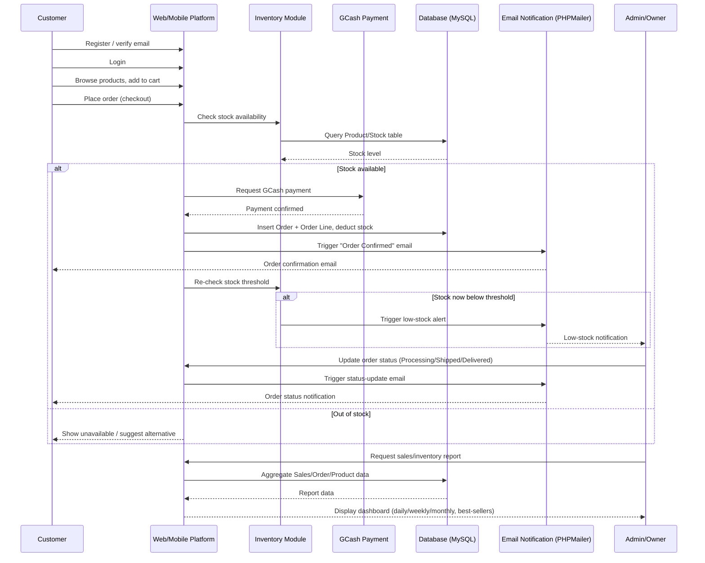

# ChardWorkz — THESIS2 Summary

## 1. Project/Document Overview

THESIS2.pdf ("A Web and Mobile-Based Point-of-Sales System with Email Notification for Mr. Siklo Motor Parts and Gears Trading," Busante/Calvario/Leyble/Pama, SIAA311, 2024) proposes a web-and-mobile ordering, sales, and inventory system for **Mr. Siklo Motor Parts and Gears Trading** (Marcos Highway, Antipolo). Unlike THESIS1's fully paper-based locale, Mr. Siklo already records sales in Microsoft Excel but still takes orders on paper and has no real-time stock visibility — the proposed system replaces both with a unified platform featuring online ordering, GCash payment, automated low-stock alerts, and email notifications for order status.

## 2. Comprehensive Section Summary

### Chapter 1 — Introduction
- **Background:** Sales are recorded in Excel (a step up from pure paper, but still manual and error-prone); the owner has no reliable way to know what needs restocking beyond manual counts/guesses, causing stockouts.
- **General problem:** difficulty managing inventory and tracking sales, causing inefficiencies in restocking and order processing.
- **Specific problems:** (1) ordering is done manually on paper; (2) inventory is tracked manually via Excel with inaccurate stock counts; (3) sales records are manually entered in Excel, risking human error; (4) customers get no real-time order-status updates.
- **General objective:** design and develop a web/mobile ordering, sales, and inventory system that automates sales tracking and inventory management, with stock-level reminders and email order-status notifications.
- **Specific objectives:** automate ordering; build real-time inventory tracking with low-stock alerts; automate sales tracking to reduce human error; implement email notifications from order confirmation through delivery.
- **Scope:** desktop + mobile UI for catalog/cart/checkout; automatic stock updates with low-stock alerts; GCash digital payment; email order-status notifications; sales/inventory reporting.
- **Limitations:** scope limited to sales/inventory (no payroll, tax, or full financial accounting); email handled via **PHPMailer**; desktop web platform covers both user and admin sides; **mobile web platform is user-side only** (no mobile admin).
- **Significance:** benefits mapped to six stakeholder groups — management (real-time data, better decisions, demand forecasting), customers (convenience, timely updates), staff (reduced workload/errors), suppliers (fewer shortages/last-minute orders via better inventory accuracy), the motor-parts industry generally (reference case), and researchers/future researchers (academic contribution).
- **Definition of terms:** Inventory Management, Web-Based System, Mobile-Based System, Stock Level, Notification System, Sales Tracking.

### Chapter 2 — Review of Related Literature
**Conceptual Framework:** An Input→Process→Output→Feedback model.
- *Input:* knowledge requirements (customer info, inventory data, sales records), hardware requirements (i3+/dual-core/4GB RAM/500GB HDD-SSD + customer smartphones), software requirements (PHP, MySQL, HTML, CSS, JavaScript, email-notification APIs).
- *Process:* data-gathering (interviews, observation, document review) feeding an **Agile SDLC** (requirements → design → development → testing → deployment → review).
- *Output:* automated sales tracking, real-time inventory management, low-stock alerts, GCash integration, email notifications.
- *Feedback Loop:* user feedback and usage/performance data cycle back into future input, enabling continuous refinement.

**Literature reviewed** (each paired by the authors with a "how this applies to Mr. Siklo" rationale):

| Source | Core finding | Relevance cited |
|---|---|---|
| Cordial (2020) — Local | Inventory tools (JIT, safety stock, FIFO, demand forecasting) for PH micro-businesses | Motivates automating stock tracking for a small owner-run shop |
| Glindro et al. (2024) — Local | Digital payment adoption in PH is growing but slowly displacing cash | Argues for keeping payment options flexible alongside GCash |
| Montano & Mercado (2023) — Local | Digital marketing, GDP, internet/mobile penetration drive PH e-commerce sales | Informs Mr. Siklo's approach to reaching an online customer base |
| Luna (2021) — Local | POS systems speed checkout, support multiple payment channels, improve inventory accuracy | Direct case for adopting a POS system |
| Ladia et al. (2023) — Local | Asset-tracking/order-processing DSS for a ship-management firm improved reliability/portability | Precedent for automating tracking + reporting; suggests SMS/chat/RFQ as future features |
| Zhang, Huang & Yuan (2021) — Foreign | Spare-parts inventory management literature review; gaps in life-cycle planning, big-data use | Supports reorder-alert design and future analytics potential |
| Kaya et al. (2024) — Foreign | Newsvendor/Order-Up-Policy + SBA/Croston forecasting for intermittent demand | Relevant to motor parts' unpredictable demand patterns |
| Bhalla et al. (2021) — Foreign | Spare-parts classification/forecasting/inventory-control literature review | Reinforces need for integrated classification + forecasting |
| Ardiyansyah & Fitrani (2021) — Foreign | E-KELONTONG mobile app improved grocery store ordering/supplier communication | Parallel case for mobile-based ordering + communication |
| Pawar et al. (2024) — Foreign | Inventory systems give real-time visibility, cost control, automation for general stores | Validates core inventory-system objectives |
| Magallanes et al. (2021) — Local study | Automated inventory system for LJJG Motorcycle Parts reduced inaccuracies/stockouts | Closest direct precedent — same industry (motorcycle parts) |
| Maurat et al. (2024) — Local study | POS + CRM + appointment scheduling (Android) improved ops via real-time inventory | Suggests CRM/appointment concepts as possible extensions |
| Catubag et al. (2024) — Local study | "Angels and Lemons" web ordering system (demo-only) reduced order errors via cart + e-wallet prototypes | Precedent for cart/e-wallet UX, explicitly non-production |
| Bermusa et al. (2020) — Local study | Web ordering + SMS-notified inventory system improved efficiency/security | Precedent for order tracking + customer notifications (SMS vs. this study's email) |
| Anade et al. (2023) — Local study | Inventory audit at a university identified stockouts/overstock/record inaccuracies | General case for systematic inventory management |
| Pratama & Wulandari (2023) — Foreign study | Web/mobile system replaced manual bookkeeping for a cassava trader | Cross-industry precedent for digitizing manual tracking |
| Weerasekara (2021) — Foreign study | RAD-built restaurant ordering/management system cut costs/errors | Cross-industry precedent for a RAD-style build |
| Chin, Ramiah & Razali (2023) — Foreign study | PHP/HTML/CSS/JS RAD-built IMS for Malaysian SMEs | Directly informs the proposed system's tech stack choice |
| Anyanwu & Anumaka (2020) — Foreign study | POS adoption drives cashless-policy uptake in Nigeria, but transaction errors hurt trust | Cautionary note on transaction-error handling |
| Salih, Ghazi & Aljanabi (2023) — Foreign study | AI-driven automated inventory system cut costs/improved forecasting for an Iraqi SME | Precedent for future analytics/AI extension |

### Chapter 3 — Research Methodology
- **Locale:** Mr. Siklo Motor Parts and Gears Trading, Marcos Highway, Antipolo, Philippines — retail store serving walk-in and (proposed) online customers.
- **Respondents:** Business Owner, Employees (cashiers/inventory staff), Customers — selected via **purposive sampling**.
- **Sample size:** 1 owner/manager, 2–3 employees, 10–20 customers.
- **Development methodology — Agile SDLC, six phases:**
  1. **Requirements** — gather needs from owner/staff (sales tracking, inventory, engagement, reporting).
  2. **Design** — system architecture, DB structure, UI mockups/wireframes for web and mobile.
  3. **Development** — incremental/sprint-based build of sales, inventory, and notification modules.
  4. **Testing** — functionality, usability, and performance/load testing.
  5. **Deployment** — install, migrate data, train users, gather real-world feedback.
  6. **Review** — gather owner/staff/customer feedback for ongoing refinement.
- **Design/modeling tools referenced** (figures are images, described narratively in-text):
  - **HIPO** breakdown: User Management, Product Management, Inventory Management, Order Management, Notification System, Reports & Analytics.
  - **VTOC** (Virtual Table of Contents), expanded across Figures 4–4.7 into detailed sub-modules: user registration/login/account management; product listing/search/details; cart/order placement/order tracking; admin-side stock monitoring/replenishment/low-stock alerts; payment method selection (GCash/e-wallet) + payment verification + invoicing; customer feedback (reviews/ratings + admin response); notification system (email verification, order-status emails, account-status notices, low-stock alerts to admin); and admin sales/analytics reporting (daily/weekly/monthly, best-sellers).
  - **Context Diagrams:** Old System (manual — customers view products/purchase/pay/receive receipt; staff manage inventory/sales/receipts; suppliers restock) vs. Proposed System (adds registration, email verification, cart/checkout, order tracking, and admin-managed accounts/payments/purchase history).
  - **Data Flow Diagrams (3 levels):** customer flow (account→browse→cart→order→payment validation→status notification, with a 3-day re-verification window for order accuracy); employee flow (inventory tracking, payment verification, order processing); admin flow (full CRUD over products/inventory/orders/users + sales analytics via a dashboard).
  - **Architectural Design:** client devices (desktop/mobile) → web server (backend/auth) → database server → POS subsystem (staff order/inventory management) → admin server (oversight).
  - **Office Layout:** stock room (helmets/gears/top boxes), organized shelving, cashier area near entrance with an intercom.
  - **Hardware/Software Specification:** OS = Windows or Linux (server-dependent); software = web browsers, **XAMPP**, **PHP**, **phpMyAdmin**; client hardware = Intel i3, 4GB RAM, 500GB storage; server hardware = Intel i5, 16GB RAM, 1TB SSD; networking = secure VPN + high-speed Ethernet.

> **Note on missing content:** The extracted text covers the full Table of Contents (through Chapter 5 and Appendices) and Chapters 1–3 in detail, plus the Fishbone Diagram heading, but the actual body content of **Chapter 4 (Data Presentation)** and **Chapter 5 (Summary, Conclusion, and Recommendation)** was not present in the extracted text — the document appears to end at the Fishbone Diagram/References. If those chapters exist in a fuller version of this file, they were not available for this summary.

## 3. Key Points & Takeaways

**Requirements**
- Web (desktop, user + admin) and mobile web (user-side only) interfaces.
- Cart, checkout, and **GCash** e-payment integration.
- Real-time inventory updates tied directly to order placement, with **low-stock alerts to the admin**.
- **Email notifications** (via PHPMailer) covering registration verification, order confirmation/processing/delivery, and account status changes.
- Sales and inventory analytics dashboard for the admin (daily/weekly/monthly sales, best-sellers).
- Customer feedback/ratings module with admin review-and-response capability.

**Tech stack**
- Backend/language: PHP
- Database: MySQL (via phpMyAdmin)
- Frontend: HTML, CSS, JavaScript
- Dev/hosting stack: XAMPP; server OS Windows or Linux
- Client hardware: Intel i3+, 4GB RAM, 500GB storage
- Server hardware: Intel i5+, 16GB RAM, 1TB SSD
- Networking: secure VPN + high-speed Ethernet

**Constraints**
- Scope explicitly excludes payroll, tax, and full financial accounting.
- Mobile platform is **user-only** — no mobile admin panel; all admin functions are desktop-web-only.
- Payment is scoped to GCash specifically (no stated fallback for card/cash-on-delivery in the system design, though literature review notes broader digital-payment trends).

**Success criteria / validation approach**
- No formal IT-expert-vs-end-user evaluation split (unlike THESIS1); instead, feedback is gathered directly from the three respondent groups (owner, employees, customers) via the Agile "Review" phase and post-deployment real-world feedback.
- Testing phase explicitly covers functionality, usability, and performance/load testing (multi-user/multi-transaction handling) before deployment.

**Notable gap**
- No Data Dictionary or ER Diagram content was extractable as text (Figure 5, ER Diagram, is image-only) — unlike THESIS1, which had a full table-level data dictionary. Any schema work based on this document would need to be inferred from the module/VTOC descriptions rather than copied from an explicit table definition.

## 4. Process Flow Diagram

