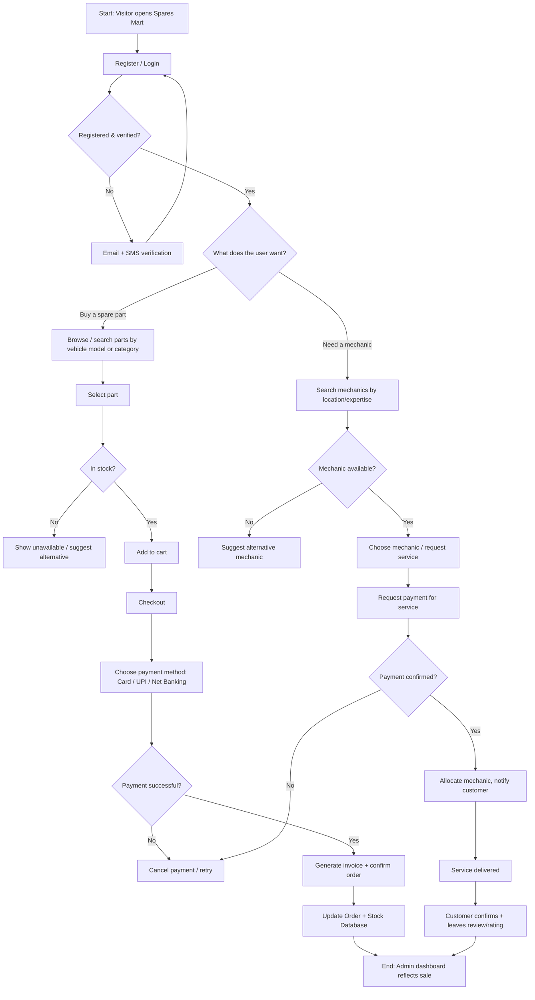

# ChardWorkz — THESIS3 Summary

## 1. Project/Document Overview

THESIS3.pdf ("Spare Parts Management System — 'Spares Mart'," Jaiswal/Yadav/Gupta/Gupta, BCA capstone, Deen Dayal Upadhyaya Gorakhpur University, India, 2021–2024) proposes a **two-and-four-wheeler spare-parts e-commerce website** that also functions as a **mechanic-booking marketplace** — customers can browse and buy vehicle parts online and separately find/book registered mechanics for installation, repair, or maintenance. It targets vehicle owners, independent mechanics, and even parts shops sourcing stock, and is built on a plain PHP/MySQL stack. **Important caveat surfaced during review:** parts of this document's requirements sections contain content clearly copy-pasted from unrelated project templates (see the flag under Chapter 2 below) — this reduces confidence in a couple of specific subsections without affecting the rest of the document.

## 2. Comprehensive Section Summary

### Chapter 1 — Introduction
- **Background:** Founded by "automotive enthusiasts and entrepreneurs" to simplify sourcing spare parts, which the authors frame as traditionally cumbersome, time-consuming, and expensive.
- **Objective:** a user-friendly platform emphasizing convenience, quality assurance, a comprehensive catalog, access to skilled mechanics, competitive pricing, customer support, secure/timely delivery, mobile accessibility, and continuous improvement via user feedback.
- **Purpose:** make buying vehicle parts online easy, with fair prices, ease of use, fast delivery, responsive support, installation guidance, and (aspirationally) eco-friendly options like recycling.
- **Scope (as framed by the authors, more like planning questions than firm decisions):** what product range to carry (brakes, filters, accessories, etc.), target audience (owners, mechanics, businesses), sourcing (suppliers/manufacturers), pricing tier (budget vs. premium), additional services (mechanic install/maintenance), and payment/shipping options.
- **Applicability:** online shopping for parts; useful to repair professionals; usable by parts shops for restocking; accessible from computer, phone, or tablet.

### Chapter 2 — System Analysis
- **Problem definition:** inventory management/stockouts, inaccurate or incomplete product data (specs/compatibility), and the difficulty of matching parts to a customer's specific vehicle make/model/year.
- **Feasibility study:** generic treatment of Economic, Technical, and Behavioral feasibility (textbook definitions, not site-specific figures or numbers).
- **Current vs. Proposed System:** described only in generic, templated terms ("the way things are currently done" / "what you aim to create") — no locale-specific current-state detail (unlike THESIS1's and THESIS2's detailed narratives of an existing manual process).

  > ⚠️ **Content integrity flag:** Two subsections of this chapter contain text that does not belong to a spare-parts/mechanic platform at all:
  > - **Section 2.5 "Requirement Specification"** describes an *Admin* who "update[s] the information of the crime report" and a *User* workflow of filing "Mobile, Vehicle, Person and Other Crime complaints," receiving a "complaint id," and giving feedback — this is boilerplate from an unrelated **crime-reporting system** template.
  > - **Section 2.10 "Conceptual Model," item 1 (Requirement Analysis)** lists requirements about "the rent a book of reader," having "all the book at one place," and avoiding being "overwhelmed from messy books in library" — boilerplate from an unrelated **book-rental/library system** template.
  >
  > Neither of these reflects Spares Mart's actual functionality (which is otherwise clearly and consistently described elsewhere in Chapters 2–4). Treat any "requirements" sourced specifically from these two subsections as **not authored for this project** — do not carry them into any derived specification.

- **Software requirements:** Windows OS; MySQL database; PHP platform; HTML/CSS/JavaScript (plus a mention of "React JS" in this bullet list, which is not reflected anywhere in the actual implementation code shown in Chapter 4 — likely aspirational or another copy-paste artifact); Chrome/Edge browsers; VS Code.
- **Hardware requirements:** Intel Core i5, 8GB RAM, 1TB HDD + 500GB SSD.
- **Technology justification:** brief write-ups of VS Code, HTML, CSS, JavaScript, MySQL, PHP, and SQL — standard textbook descriptions of each tool's role.
- **Planning & Scheduling:** generic project-management concepts (define objectives, scope/requirements, budget/resources, risk assessment, tech-stack selection; then task identification, sequencing, resource allocation, monitoring, communication, risk management). A Gantt Chart and Work Breakdown Structure are referenced as figures but are image-only, not text-extractable.
- **Conceptual Model:** a linear/waterfall-style process — Requirement Analysis (partially the mismatched book-rental text noted above) → Design (Class, ER, Use-Case, and Event diagrams) → Coding & Unit Testing → Integration & System Testing → Maintenance (post-deployment debugging and enhancement).

### Chapter 3 — System Design
**Module Division:**
- **User (non-registered):** Home (overview of parts + mechanic services), Spare Parts & Accessories browsing (with price/description/images), Mechanics Services info, About Us, Contact Us, and Registration (triggers email + SMS verification, a payment link, and a downloadable invoice/fee receipt).
- **User (registered/logged in):** view order/dispatch status, product pricing, add-to-cart, and an optional subscription.
- **Mechanics module:** mechanic registration/login (name, contact, credentials), profile management (photo, bio, expertise areas), and query handling (view/respond to incoming service requests, with notifications for new queries).
- **Admin module:** profile/password management and logout; a **Dashboard** summarizing total users, products, registrations, new registrations, logins, product sales, and stock/payment status; **Spare Parts Status** (manage products/accessories); **Mechanics** management (availability, payments, subscriptions); **Pages** management (About/Contact content); **Registration** review (approve/reject with remarks, verification email/SMS); **Reports** (sales and registration activity by period); **Invoice** management; and **Search Registration** by registration number.

**Data Dictionary** — six databases (field-level tables in the source PDF suffered OCR/layout corruption converting the PDF to text — the columns below are reconstructed from context, not a literal transcription):
1. **Admin Database** — Admin ID (PK), Password.
2. **User & Customer Registration Database** — User ID (PK), Password, Name, Contact, Email, Address (all `Not Null`).
3. **Mechanics Database** — Mechanic ID (PK), Name, Contact, Location, Fees, Review (all `Not Null`).
4. **Spare Parts / Stock Database** — Stock ID (PK), Name, Type, Quantity, Description, Price (all `Not Null`).
5. **Payment Database** — Payment ID (PK), Amount, User ID (FK), Stock ID (FK), Order ID (FK), Transaction ID, Card (details garbled in source but clearly payment-method fields).
6. **Order Database** — Order ID (PK), User ID (FK), Stock ID (FK), Value, Quantity, Location, Invoice No.

**ER Diagram & Data Flow Diagrams:** image-based (not text-extractable); the accompanying (also OCR-garbled) narrative confirms three flows: (1) registration/login/forgot-password with email verification, (2) spare-parts search → stock-availability check → cart → payment request/response → success or cancellation → invoice, and (3) mechanic search → availability check → allocation → payment request → confirmation → receipt.

**UML Diagrams** (figures are images; content reconstructed from surrounding OCR text):
- **Class Diagram:** Customer, Spare Parts, Mechanic, Admin, Payment, and Order classes with attributes (e.g., Customer: id/name/phone/email; Spare Parts: name/description/price/quantity; Payment: transaction/net-banking/UPI/e-invoice details).
- **Activity Diagram:** login → validation (invalid loops back) → home page → search (mechanics or parts/accessories) → for parts: check stock (available/not available) → payment & billing → verification → place order; for mechanics: check availability → provide mechanic.
- **Use Case Diagram:** Customer actions — registration, choosing a vehicle model, checking/providing stock, receiving suggestions/allocation, choosing a mechanic, checking mechanic availability, placing an order, requesting/providing payment, confirming payment, generating an e-bill; Admin/Mechanic provide supporting info (stock, mechanic availability).
- **Sequence Diagram:** Customer/Mechanic/Admin interacting through an Authentication component — registration → account creation → authentication confirmation → mechanic search/suggestion/allocation → payment request/method → delivery → receipt confirmation.
- **Component & Deployment Diagrams:** referenced as figures only, no narrative description extracted.

### Chapter 4 — Implementation and Testing
- Includes **actual PHP/MySQL source code** for three authentication flows:
  - **User registration/login** (`login.php`) — passwords hashed with **`md5()`**.
  - **Mechanic registration/login** (`signup.php`/`login.php`) — passwords hashed with **`password_hash()`/`password_verify()`** (bcrypt), plus file-upload handling for a profile photo with extension whitelisting (jpg/jpeg/png).
  - **Admin login** — also hashes with **`md5()`**.
  - > ⚠️ **Inconsistency flag:** the User and Admin logins use MD5 (a hashing algorithm that is fast and unsalted, and is not considered secure for password storage), while the Mechanics module uses PHP's modern `password_hash()`/`password_verify()`. Any real implementation should standardize on the bcrypt-based approach for all three account types.
- **Testing approach:** Functionality (registration/login/logout, search, cart/checkout/order flow, mechanic booking, reviews), Compatibility (cross-browser: Chrome/Firefox/Safari/Edge; cross-device: desktop/tablet/mobile), Performance (load times under normal/peak load), Security (SQL injection/XSS scanning, data encryption, access control), and Usability (real-user testing, feedback on design/navigation).
- **Test levels:** Unit Testing (auth, product management, cart, order management, mechanic management, tested independently), Integration Testing (verifying modules work together, e.g., auth feeding into registration/login), Beta Testing (limited external user group evaluating usability/functionality pre-launch), and a Modification/Improvement feedback loop (evaluate feedback → prioritize → implement → retest → deploy → monitor → iterate).
- **Test case table (sample, all marked Pass):** required-field validation, email-format validation, duplicate-email detection on registration, password validation, and phone-number validation (must be exactly 10 digits).
- Admin-panel screenshots referenced for category/subcategory/product management (image-only content — e.g., a "Manage Categories" table showing Bikes/Cars/Accessories with creation dates).

### Chapter 5 — Results & Discussion
Consists primarily of admin-panel UI screenshots (category, subcategory, and product management screens) with minimal surrounding narrative; the OCR-extracted text for this section is fragmentary and mostly reproduces on-screen table data (e.g., product listings like "Hero Brake Lever," "KIT, DISC CLUTCH FRICTION") rather than discussion prose.

### Chapter 6 — Conclusion and Future Work
- **Conclusion:** highlights a wide car/bike parts catalog, the added mechanic-services marketplace, an intuitive browsing/ordering experience, mechanic transparency (qualifications, availability, reviews), and dedicated customer-support channels.
- **Limitations (author-acknowledged):** limited geographic/logistics reach, competitive market pressure, technical risks (performance/security/scalability), inventory-management complexity, the challenge of building customer trust, and regulatory compliance.
- **Future scope:** improved navigation/search UX, mobile optimization, expanded product categories, international expansion, AI/automation adoption, and social-media-driven customer engagement.

### Chapter 7 — References
Almost entirely generic tooling/learning references (Google, YouTube, ChatGPT, W3Schools, Stack Overflow) rather than academic citations — notably, this thesis has no dedicated Review-of-Related-Literature chapter, unlike THESIS1 and THESIS2.

## 3. Key Points & Takeaways

**Requirements**
- Dual-purpose platform: spare-parts e-commerce (browse/cart/checkout/invoice) **plus** a mechanic-booking marketplace (mechanic profiles, availability, reviews, service requests).
- Registration flow includes both **email and SMS verification**, a payment link, and a downloadable fee receipt/invoice.
- Admin dashboard aggregates users, products, registrations, logins, sales, and stock/payment status in one view.
- Reporting is period-based (sales and registration activity by date range), plus dedicated invoice and registration-search tools.

**Tech stack**
- Backend: PHP (procedural, with prepared statements used in the mechanics module but raw string-interpolated queries in the user/admin login samples — a SQL-injection risk in the latter)
- Database: MySQL
- Frontend: HTML, CSS, JavaScript (Bootstrap-based UI in the shown code; "React JS" is listed as a requirement but not evidenced in the implementation)
- Dev environment: VS Code, Windows, Chrome/Edge
- Hardware: Intel i5, 8GB RAM, 1TB HDD + 500GB SSD

**Constraints / risks (author-acknowledged or observed)**
- Geographic/logistics reach limits, competitive pressure, scalability/security concerns, inventory complexity, customer-trust building, and regulatory compliance (author-stated limitations).
- **Security inconsistency:** MD5 password hashing for User/Admin vs. bcrypt for Mechanics — a real gap, not a stylistic choice.
- **Requirements-integrity gap:** Sections 2.5 and 2.10(1) contain unrelated copy-pasted template content (crime-reporting and book-rental systems, respectively) — do not treat these two subsections as authoritative for Spares Mart's actual requirements.
- Payment fields (Net banking, UPI, Card, E-Invoice) suggest a broader payment scope than THESIS1 (cash-only) or THESIS2 (GCash-only), though the payment gateway integration itself is not shown in the implementation code.

**Success criteria / validation approach**
- No formal stakeholder-evaluation framework (no IT-expert/end-user split as in THESIS1, no respondent-sampling plan as in THESIS2) — validation here is purely technical: a five-category test approach (functionality, compatibility, performance, security, usability) plus unit/integration/beta testing and a small pass/fail test-case table.

## 4. Process Flow Diagram

