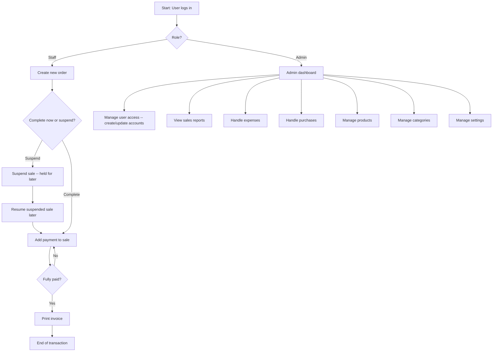

# ChardWorkz — THESIS4 Summary

> **Source note:** Unlike THESIS1–3 (each distilled from a full .docx/.pdf capstone with chapters, cited literature, and a data dictionary), this summary is built from a short user-supplied synopsis only. There is no literature review, tech-stack detail, hardware spec, or data dictionary to summarize — sections below cover only what the synopsis states. Treat this as thinner reference material than Thesis 1–3 until (if ever) the full source document is provided.

## 1. Project Overview & Context

The synopsis describes a **Point of Sale (POS) and Inventory Management system** built for a shop that currently handles all ordering and stock processes manually — described as time-consuming and complex. The system's scope is broader than transactions alone: it covers internal shop operations as well as customer-facing ordering. The stated goal is to reduce the time required to perform day-to-day shop tasks. No shop name, branch count, platform (web/desktop/mobile), or technology stack is given in the synopsis.

## 2. User Roles

Two roles are defined, split by operational vs. transactional responsibility:

| Role      | Responsibilities (per synopsis)                                                                                                |
| --------- | ------------------------------------------------------------------------------------------------------------------------------ |
| **Admin** | Manage user access, view sales reports, handle expenses, handle purchases, manage products, manage categories, manage settings |
| **Staff** | Create new orders, suspend sales, print invoices, add payments to sales                                                        |

## 3. Key Features

**Admin-side**

- User access management (account-level control, implies Admin creates/manages other accounts)
- Sales reporting (viewing, not just generating)
- Expense tracking
- Purchase handling (likely supplier/stock-in side, not explicitly detailed)
- Product management
- Category management
- System settings

**Staff-side**

- New order creation
- Suspend sale (hold an in-progress sale to resume later — a capability not present in THESIS1's scope, and not explicitly called out in THESIS2/3 either)
- Invoice printing (contrasts with THESIS1, where the receipt is explicitly display-only, not printed)
- Add payments to a sale (implies partial/multiple payments against one sale, rather than a single cash-tender-and-change flow)

## 4. Visual Flow Diagram

### 4.1 Staff Ordering & Admin Management Process

## 5. Open Questions (not answered by the synopsis)

- Platform: web, desktop, or mobile?
- Single shop/branch, or multi-branch like THESIS1/THESIS3?
- Payment methods supported (cash only? digital, like THESIS2's GCash integration?)
- Whether "purchases" here means supplier/stock-in (as in THESIS1's Supplier Invoice) or something else
- Whether an Owner-level read-only role exists (present in THESIS1/THESIS3, absent from this synopsis)
