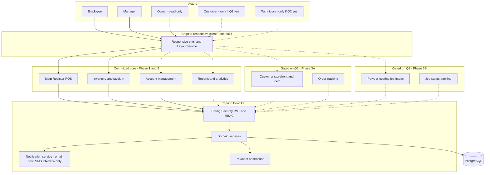
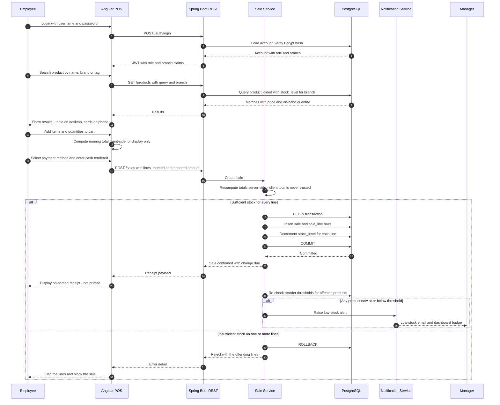
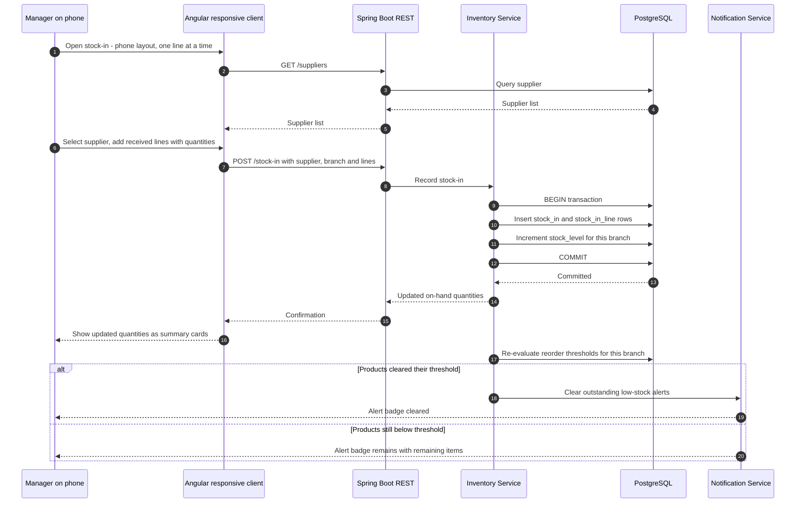
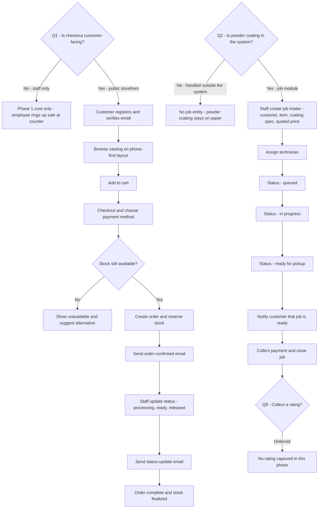
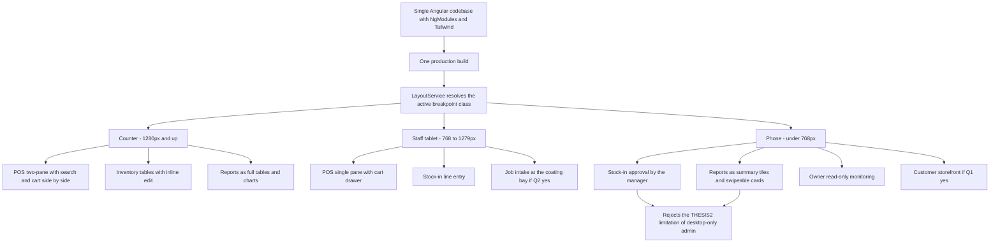

# ChardWorkz — Project Initiation Draft

**Source of truth:** `ChardWorkz_Thesis1_Summary.md`, `ChardWorkz_Thesis2_Summary.md`, and `ChardWorkz_Thesis3_Summary.md` (derived from `RELATED DOCUMENTS/THESIS1.docx`, `THESIS2.pdf`, `THESIS3.pdf` — three unrelated academic capstones used only as reference patterns for a real business, ChardWorkz Racing Team and Powder Coating Services).

**Status:** Section 5's 12 open questions were answered by the business owner on 2026-09-15 (see §0.1 and each question's **Resolved** line below). `PROJECT-CONTEXT.md` has been updated to reflect the resolved scope. This document remains the detailed source of truth; still in draft pending a full internal consistency pass now that the fork points are settled.

---

## 0.1 Change Log — v0.3 → v0.4 (2026-09-15)

All 12 open questions in §5 answered by the business owner. Highlights:

- **Q1/Q2 confirmed the working defaults:** staff-only for Phase 1–2 (no storefront yet), powder-coating job module explicitly deferred (not this phase). Phase 3A/3B stay documented as future-attachable phases, not deleted.
- **Q12 broke from its stated default** — the owner chose **local queue + sync-on-reconnect** (option c) over the document's paper-fallback default, citing it as the modern retail-POS standard. This is a real Phase 1 architectural commitment (offline storage, sync state UI), not a later add-on — see the new Phase 1 deliverable and Reference Schema Sketch note below. Two accepted limitations come with it: card-present offline authorization is moot for now (Q4 = manual confirmation, no gateway), and a multi-register stock race during a simultaneous outage is an accepted low risk, not something Phase 1 resolves.
- **Q8 added a forward-looking note:** void-before-finalize only for Phase 1 (as defaulted), but post-finalization sale reversal is flagged for a later phase rather than ruled out.
- **Q10 confirmed real production**, which per the vault's `CLAUDE.md` §6 means `05 -Skills/production-security-checklist.md` must be walked against the actual codebase before any real deployment.
- Q3, Q4, Q5, Q6, Q7, Q9, Q11 all confirmed their stated defaults with no changes.

## 0. Change Log — v0.2 → v0.3 (2026-09-11)

This revision folds THESIS2 and THESIS3 into the _body_ of the document. In v0.2 those two sources existed only as a cross-reference narrative and a list of open questions; the Architecture and Roadmap sections were still THESIS1-only (staff-only, desktop-only, no notifications, no diagrams). v0.3 also makes **web + mobile-responsive** a first-class constraint in every section rather than an unstated assumption.

### Added

| #   | Addition                                                                                                                         | Source                                                                            | Location        |
| --- | -------------------------------------------------------------------------------------------------------------------------------- | --------------------------------------------------------------------------------- | --------------- |
| A1  | **Change Log** section                                                                                                           | —                                                                                 | §0              |
| A2  | **Platform Scope** — one responsive Angular codebase, three breakpoint classes (counter desktop / staff tablet / customer phone) | THESIS2 (web+mobile premise), THESIS3 (cross-device testing)                      | §1              |
| A3  | **Module Inventory** table — every module states its _web_ behavior and its _mobile_ behavior explicitly                         | THESIS1 modules, THESIS2 HIPO/VTOC, THESIS3 module division                       | §2              |
| A4  | **Notification Service** component — Spring Mail for email; SMS behind an unimplemented interface                                | THESIS2 (PHPMailer, order-status + low-stock), THESIS3 (email + SMS verification) | §2              |
| A5  | **Payment Abstraction** component — `payment_method` enum plus manual reference capture; gateway as a pluggable port             | THESIS1 (cash), THESIS2 (GCash), THESIS3 (card/UPI/net-banking)                   | §2              |
| A6  | **Job / Service module** component — THESIS3's Mechanics pattern generalized to a powder-coating job entity                      | THESIS3 Mechanics module                                                          | §2, §4 Phase 3B |
| A7  | **File / media storage** component — product and job photos, extension whitelisting                                              | THESIS3 (profile-photo upload with jpg/jpeg/png whitelist)                        | §2              |
| A8  | **Multi-branch scoping** — `branch_id` reserved on inventory and sales rows from Phase 0                                         | No thesis solves this; ChardWorkz-specific                                        | §2, §4 Phase 0  |
| A9  | **Audit log** component (conditional on Q7)                                                                                      | THESIS1 IT-expert "information security" criterion                                | §2              |
| A10 | **Non-Functional Requirements** table with proposed concrete targets                                                             | THESIS3 five test categories, THESIS2 load testing, THESIS1 IT-expert rubric      | §2              |
| A11 | **Reference Schema Sketch** replacing the old one-paragraph data-model note                                                      | All three (as reference patterns only)                                            | §2              |
| A12 | **§3 Visual Workflows** — five Mermaid diagrams where the document previously had none                                           | Synthesized from all three                                                        | §3              |
| A13 | **Phase 3A (conditional)** — customer storefront, gated on Q1                                                                    | THESIS2, THESIS3                                                                  | §4              |
| A14 | **Phase 3B (conditional)** — powder-coating job module, gated on Q2                                                              | THESIS3                                                                           | §4              |
| A15 | **Phase 4 validation gate table** merging all three theses' evaluation approaches                                                | THESIS1 + THESIS2 + THESIS3                                                       | §4              |
| A16 | **Q11 (mobile admin parity)** and **Q12 (offline / degraded-network counter behavior)**                                          | Q11 from THESIS2's stated limitation; Q12 unaddressed by any thesis               | §5              |
| A17 | **Impact** and **Default if unanswered** lines on every open question, so Phase 0 is never blocked                               | —                                                                                 | §5              |

### Modified

| #   | Change                                                                                                                                                                                                                                   | Source                                |
| --- | ---------------------------------------------------------------------------------------------------------------------------------------------------------------------------------------------------------------------------------------- | ------------------------------------- |
| M1  | Frontmatter — `updated` bumped to 2026-09-11, `version: 0.3` added                                                                                                                                                                       | —                                     |
| M2  | Problem Statement gains a **digital maturity baseline**: ChardWorkz sits at THESIS1's paper stage, _below_ THESIS2's Excel stage. The jump is therefore larger than THESIS2's, and user training is a real Phase 1 cost, not a footnote. | THESIS1 vs. THESIS2 locale comparison |
| M3  | **Out of Scope** rewritten from a flat list into a table with a per-item _revisit phase_. Barcode scanning moves from permanently-excluded to deferred-but-schema-reserved — cheap now, expensive to retrofit.                           | THESIS1 exclusions, re-scoped         |
| M4  | §2 Proposed Components table extended from 5 rows to 12                                                                                                                                                                                  | THESIS2, THESIS3                      |
| M5  | §2 "Core Data Flows" prose list promoted into the §3 diagrams and expanded from 4 flows to 5                                                                                                                                             | All three                             |
| M6  | §4 Phase 0 gains: responsive shell/breakpoint system, notification interface stub, and the `branch_id` / `payment_method` schema decisions up front                                                                                      | THESIS2, ChardWorkz-specific          |
| M7  | §4 Phases 1 and 2 gain an explicit **mobile acceptance criterion** per deliverable                                                                                                                                                       | THESIS2, THESIS3                      |
| M8  | §4 Phase 2 gains low-stock alerts and period/best-seller analytics                                                                                                                                                                       | THESIS2 admin dashboard               |
| M9  | Old §3 "Phase 3 — Validation Pass" renumbered to Phase 4 and broadened beyond THESIS1's rubric                                                                                                                                           | All three                             |

### Reconciled

Conflicts _between_ the three sources, and how this document settles them. These are the entries worth reading closely — each one is a place where copying a thesis verbatim would have imported a defect.

| #   | Conflict across sources                                                                                                                                                                                                    | Resolution here                                                                                                                                                                                                                           |
| --- | -------------------------------------------------------------------------------------------------------------------------------------------------------------------------------------------------------------------------- | ----------------------------------------------------------------------------------------------------------------------------------------------------------------------------------------------------------------------------------------- |
| R1  | **Password hashing.** THESIS1 stores credentials with no stated hashing. THESIS3's own code uses MD5 for User and Admin but bcrypt for Mechanics — an internal inconsistency, not a design.                                | Bcrypt via Spring Security for **all** roles, uniformly. Already settled in v0.2 §2; restated because THESIS3 makes the failure mode concrete.                                                                                            |
| R2  | **Payment scope.** THESIS1 = cash only. THESIS2 = GCash only. THESIS3's data model carries card / UPI / net-banking fields but ships no gateway integration.                                                               | One `payment_method` enum (`CASH`, `GCASH`, `EWALLET_OTHER`) plus an optional reference-number field, from Phase 1. Real gateway integration is a separate pluggable port, deferred pending **Q4**.                                       |
| R3  | **Data dictionary.** THESIS1: 11 tables with visible FK copy-paste drift. THESIS2: no table-level dictionary extractable at all. THESIS3: 6 tables, OCR-corrupted, in a document with confirmed boilerplate contamination. | **No thesis schema is copied.** ChardWorkz's schema is designed fresh from real business rules; all three are reference patterns only. Confirmation sought in **Q6**.                                                                     |
| R4  | **Mobile admin.** THESIS2 explicitly limits mobile to the customer side — "no mobile admin," all admin functions desktop-web-only.                                                                                         | **Rejected as an anti-requirement.** A ChardWorkz manager must be able to approve stock-in and read the day's sales from a phone. Treated as a THESIS2 implementation limitation, not a design principle. Confirmation sought in **Q11**. |
| R5  | **Notifications.** THESIS1: none. THESIS2: email via PHPMailer (order status + low-stock). THESIS3: email **and** SMS verification plus admin service alerts.                                                              | Email (Spring Mail) is the in-scope channel. SMS is defined as an interface with no implementation, so adding a provider later is a wiring change rather than a redesign. Channel scope pending **Q3**.                                   |
| R6  | **Requirements integrity.** THESIS3 §2.5 describes a _crime-reporting_ system and §2.10(1) a _book-rental_ system — copy-pasted boilerplate from unrelated templates.                                                      | Both subsections are **excluded** from every derived requirement in this document. Flagged permanently so a future reader does not re-import them.                                                                                        |
| R7  | **Build-tool inconsistency.** THESIS1 Ch.3 says Visual Basic 2010; Ch.4 says Visual Basic 2008.                                                                                                                            | Moot — the stack is modernized to Angular + Spring Boot + PostgreSQL. Recorded only so the discrepancy is not mistaken for a missing decision.                                                                                            |
| R8  | **Validation approach.** THESIS1: two evaluator groups. THESIS2: three respondent groups via purposive sampling, plus load testing. THESIS3: five technical test categories, no stakeholder framework.                     | Merged into a single Phase 4 gate table — stakeholder evaluation _and_ technical test categories _and_ load testing, rather than picking one.                                                                                             |
| R9  | **Service vs. product entity.** No thesis models a service/labor business. THESIS3's Mechanics module is the nearest structural analog.                                                                                    | Powder coating is modeled as a **Job** entity (intake → assign → status → price), generalized from THESIS3's Mechanics pattern. Whether it ships at all is **Q2**.                                                                        |
| R10 | **Multi-branch.** THESIS1 names two branches but is scoped "local only" with no sync. THESIS2 is single-location. THESIS3 has no branch concept.                                                                           | Unsolvable by copying. `branch_id` is reserved on inventory and sales rows from Phase 0 so either answer to **Q5** stays cheap; the sync _behavior_ itself remains open.                                                                  |

> **Not changed:** the Angular NgModules + Tailwind / Spring Boot Maven / PostgreSQL / Spring Security + JWT + Bcrypt stack decisions from v0.2 are carried forward verbatim. They were resolved and are not reopened here.

---

## 1. Project Scope & Vision

### Problem Statement

ChardWorkz Racing Team and Powder Coating Services (a 9-year-old motorparts shop with a second branch in Chardworkz Masinag Branch) runs its sales and inventory entirely on paper. Employees look up prices from a printed list, handwrite receipts, and total sales with a calculator (~5 minutes per customer). Stock receipts are logged in a manager's notebook with no real-time visibility into what's actually on the shelves. This produces slow transactions, illegible/lost records, and no reliable, shared view of current inventory between the manager, employees, and owner.

**Digital maturity baseline.** ChardWorkz is at THESIS1's stage — fully paper, no spreadsheet. THESIS2's locale (Mr. Siklo) had already moved sales into Excel before its system was proposed. ChardWorkz is therefore making a _larger_ jump than THESIS2's case study did, from nothing to a live transactional system. Two consequences carry into planning: user training is a real Phase 1 deliverable rather than a footnote, and there is no legacy data file to migrate — the opening inventory count is a manual, one-time data-entry exercise that has to be scheduled.

### Core Objective

Build a role-based Point of Sale and Inventory System that replaces the paper workflow with:

- Fast, accurate point-of-sale transactions (search → price/total auto-computed → cash tendered → change computed → receipt shown).
- A single source of truth for inventory levels, updated automatically by both sales and stock receipts.
- Manager-controlled employee accounts and product catalog, with owner-level read visibility for transparency.
- Sales and inventory reporting the manager can use without waiting on manual reconciliation.

### Platform Scope — Web and Mobile

**One Angular codebase, responsive, no native app.** THESIS2 was titled "Web and Mobile-Based" but delivered this as two separate treatments with an asymmetry: desktop web served both users and admins, while mobile web served customers only. ChardWorkz does not adopt that split. A single responsive build serves every role at every width, and each module below declares its behavior at each breakpoint class.

| Breakpoint class | Target width  | Primary device                                              | Primary users                 | Primary modules                                                               |
| ---------------- | ------------- | ----------------------------------------------------------- | ----------------------------- | ----------------------------------------------------------------------------- |
| **Counter**      | 1280px and up | Shop desktop or laptop at the till                          | Employee, Manager             | POS, Inventory CRUD, Reports                                                  |
| **Staff tablet** | 768–1279px    | Tablet on the shop floor or in the coating bay              | Employee, Manager, Technician | POS, stock-in, job intake (if Q2 = yes)                                       |
| **Phone**        | under 768px   | Manager's and Owner's phone; customer's phone (if Q1 = yes) | Manager, Owner, Customer      | Stock-in approval, report viewing, owner monitoring, storefront (if Q1 = yes) |

Cross-cutting mobile rules, adopted from THESIS3's compatibility-testing requirement:

- Every screen must be usable at 360px width without horizontal scrolling.
- Touch targets on POS and stock-in controls are at least 44px — these are used at speed with one hand.
- Tables never scroll horizontally on phone; they collapse to stacked cards (see the Module Inventory in §2).
- Browser matrix: Chrome, Edge, Safari, Firefox — desktop, tablet, and mobile, per THESIS3's compatibility category.

### Out of Scope — Phase 1

Rewritten from THESIS1's flat exclusion list into a table with an explicit revisit point, because several of THESIS1's "limitations" are cheap to _prepare for_ now and expensive to retrofit later.

| Item                               | THESIS1 stance           | ChardWorkz Phase 1 stance                                                                                                                | Revisit        |
| ---------------------------------- | ------------------------ | ---------------------------------------------------------------------------------------------------------------------------------------- | -------------- |
| Barcode scanning                   | Permanently out of scope | **Deferred, but prepared** — schema reserves `sku` / `barcode` on Product from Phase 0; no scanner hardware or scan UI in Phase 1        | Phase 2+       |
| Card payments                      | Out of scope             | Out of scope                                                                                                                             | Q4             |
| GCash / e-wallet                   | Out of scope (cash only) | **In scope as a recorded payment method** — enum value plus reference number, manually confirmed at the counter. No gateway integration. | Q4             |
| Printed receipts                   | Display-only             | Display-only; layout is print-stylesheet-friendly so adding a printer is CSS, not rework                                                 | Phase 2+       |
| Returns / exchanges                | Out of scope             | Out of scope                                                                                                                             | Q8             |
| Void / cancel before finalizing    | Not addressed            | **In scope, Phase 1** — void-before-finalize only; no returns, no post-finalization reversal (yet — see Q8's forward-looking note)       | Q8 — resolved  |
| Customer-facing storefront         | Not applicable           | **Resolved: out of scope for this phase** — staff-only checkout confirmed                                                                | Q1 — resolved  |
| Powder-coating job module          | Not applicable           | **Resolved: out of scope for this phase** — skip while in Phase 1                                                                        | Q2 — resolved  |
| Reviews / ratings                  | Not applicable           | Out of scope                                                                                                                             | Q9 — resolved  |
| Payroll, tax, financial accounting | Not addressed            | Out of scope (matching THESIS2's explicit exclusion)                                                                                     | —              |
| Multi-branch sync behavior         | "Local only," undefined  | **Resolved: one shared backend/DB**, `branch_id`-scoped, cross-branch read visibility for Owner/Manager                                  | Q5 — resolved  |
| Offline / degraded-network selling | Not addressed            | **In scope, Phase 1** — local queue + sync-on-reconnect (not paper fallback)                                                             | Q12 — resolved |

---

## 2. Target Architecture & Stack

The system architecture is modernized using an **Angular** frontend and a **Spring Boot** backend, structured around clean architecture principles and industry-standard tooling:

- **Frontend:** Built with **Angular (NgModules)** following a clean modular architecture where each feature/component resides in its own folder containing separated `.ts`, `.html` (HTML5 templates, avoiding inline `templateUrl`), and `.scss` files, alongside dedicated services. User interface styling is powered by **Tailwind CSS**.
- **Backend:** Built with **Spring Boot (Java)** using a **Maven** project structure generated via [start.spring.io](https://start.spring.io/). The backend incorporates key dependencies including **Spring Boot DevTools**, **Spring Web**, **Spring Data JPA**, **Spring Security**, and **Lombok** (mirroring our standard E-commerce backend architecture).
- **Database:** Powered by **PostgreSQL** to handle relational data integrity and concurrent transactions.

### Proposed Components

| Layer                    | Proposed Technology                                                                          | Rationale                                                                                                                                                                                                          | Source           |
| ------------------------ | -------------------------------------------------------------------------------------------- | ------------------------------------------------------------------------------------------------------------------------------------------------------------------------------------------------------------------ | ---------------- |
| **Client / POS UI**      | **Angular** (NgModules, HTML5, SCSS, Tailwind CSS)                                           | Web-based SPA adhering to a clean component structure — separate `.ts`, `.html`, and `.scss` per component folder, plus dedicated Services. Styled using Tailwind CSS.                                             | v0.2             |
| **Responsive UI layer**  | Tailwind breakpoints + a shared `LayoutService` exposing the current breakpoint class        | One codebase serves counter, tablet, and phone. Components subscribe to the breakpoint class rather than duplicating templates. Directly answers THESIS2's mobile/desktop split without maintaining two frontends. | THESIS2, THESIS3 |
| **Business Logic / API** | **Spring Boot (Java / Maven)**                                                               | RESTful API generated via start.spring.io. Configured with DevTools, Web, Data JPA, and Lombok to centralize transaction, inventory, and reporting logic.                                                          | v0.2             |
| **Database**             | **PostgreSQL**                                                                               | Relational DB replacing Microsoft Access. Handles normalization, concurrent transactions, and referential integrity.                                                                                               | v0.2             |
| **Auth**                 | **Spring Security + JWT**, Bcrypt hashing, RBAC for Manager / Employee / Owner               | Replaces raw credential storage. Uniform Bcrypt across all roles — explicitly correcting THESIS3's MD5-for-users / bcrypt-for-mechanics split.                                                                     | v0.2, R1         |
| **Reporting**            | Server-side aggregation (Spring Data JPA) + client-side rendering (Angular)                  | Aggregates sales and inventory data server-side and streams structured JSON to Angular for dynamic rendering and export.                                                                                           | v0.2             |
| **Notification service** | **Spring Mail** (email); `SmsSender` interface with **no implementation** in Phase 1         | THESIS2 used PHPMailer for order-status and low-stock alerts; THESIS3 added SMS verification. Email covers both needs. SMS stays an interface so a provider is a wiring change, not a redesign. **Resolved 2026-09-15 (Q3): notifications skipped entirely for Phase 1** — this whole component is now a later-phase concern.  | THESIS2, THESIS3 |
| **Payment abstraction**  | `payment_method` enum + optional `payment_reference`; gateway behind a `PaymentGateway` port | Absorbs all three theses' payment scopes without committing to any. Phase 1 is manual confirmation at the counter. Pending Q4.                                                                                     | R2               |
| **Job / Service module** | `Job` entity — intake, assigned technician, status, service price                            | THESIS3's Mechanics module (provider, availability, booking, pricing, reviews) generalized. Powder coating is a job, not a product. Gated on Q2.                                                                   | THESIS3, R9      |
| **File / media storage** | Server-side file store with extension whitelist (jpg/jpeg/png) and size cap                  | Product images, and job before/after photos if Q2 = yes. Follows THESIS3's upload pattern, which did whitelist extensions correctly.                                                                               | THESIS3          |
| **Audit log**            | Append-only `audit_event` table — actor, entity, field, old value, new value, timestamp      | Supports THESIS1's IT-expert "information security" evaluation criterion and answers "who changed this price." **Resolved 2026-09-15 (Q7): yes, unconditional from Phase 0.**                                                                               | THESIS1, Q7      |
| **Multi-branch scoping** | `branch_id` FK on inventory, sales, and stock-in rows; branch claim in the JWT               | No thesis solves multi-branch. Reserving the column and the claim from Phase 0 keeps both answers to Q5 cheap; the sync behavior itself stays open.                                                                | R10              |

### Module Inventory — Web and Mobile Behavior

This table is the concrete answer to "account for both web and mobile." Every module states what it does at counter width and what it does at phone width; a module with no defined phone behavior is a gap, not an omission.

| Module                             | Source                                  | Phase              | Counter / desktop behavior                        | Phone behavior                                                                                                                       |
| ---------------------------------- | --------------------------------------- | ------------------ | ------------------------------------------------- | ------------------------------------------------------------------------------------------------------------------------------------ |
| **Auth / login**                   | T1, T2, T3                              | 0                  | Centered form, role redirect                      | Identical, single-column, keyboard-aware                                                                                             |
| **Main Register (POS)**            | T1                                      | 1                  | Two-pane: product search left, running cart right | Single pane — search full-width; cart collapses to a persistent bottom sheet showing item count and total, expandable to full-screen |
| **Product search**                 | T1 (tag/brand search)                   | 1                  | Inline results table under the search box         | Result cards, tap-to-add, no horizontal scroll                                                                                       |
| **Cash / change entry**            | T1                                      | 1                  | Numeric input + computed change panel             | Full-width numeric keypad, 44px minimum keys — the highest-speed touch interaction in the system                                     |
| **On-screen receipt**              | T1 (display-only)                       | 1                  | Modal with print-friendly stylesheet              | Full-screen sheet, dismiss-to-close                                                                                                  |
| **Inventory CRUD**                 | T1                                      | 1                  | Sortable table with inline edit                   | Card list; edit opens a full-screen form. **Explicitly available on phone** — see R4                                                 |
| **Stock-in / supplier invoice**    | T1                                      | 1                  | Multi-line invoice entry grid                     | Add-one-line-at-a-time flow with a running summary. Manager approves stock-in from a phone                                           |
| **Sales history**                  | T1 (per-employee log)                   | 1                  | Filterable table, date + employee                 | Grouped cards by date, infinite scroll                                                                                               |
| **Employee account management**    | T1 Manager Module                       | 2                  | Table + create/edit modal                         | Card list + full-screen form                                                                                                         |
| **Reports**                        | T1 (Sales-for-the-Day, Inventory)       | 2                  | Full tables + charts, exportable                  | Summary tiles first, then swipeable report cards. Tables never scroll horizontally                                                   |
| **Low-stock alerts**               | T2                                      | 2                  | Dashboard banner + email to manager               | Email plus an alert badge in the mobile nav                                                                                          |
| **Sales analytics**                | T2 (daily/weekly/monthly, best-sellers) | 2                  | Chart grid                                        | One chart per screen, vertically stacked                                                                                             |
| **Owner monitoring**               | T1                                      | 2                  | Read-only mirrors of reports and inventory        | Read-only summary tiles — the owner is the most likely phone-only user                                                               |
| **Customer accounts + storefront** | T2, T3                                  | 3A _(gated on Q1)_ | Catalog grid, cart, checkout                      | Mobile-first; the one module where phone is the _primary_ target                                                                     |
| **Order tracking + status email**  | T2                                      | 3A _(gated on Q1)_ | Order list with status timeline                   | Status timeline as a vertical stepper                                                                                                |
| **Powder-coating job intake**      | T3 (Mechanics pattern)                  | 3B _(gated on Q2)_ | Intake form + technician assignment board         | Tablet-first — filled in at the coating bay, not at a desk                                                                           |
| **Job status tracking**            | T3                                      | 3B _(gated on Q2)_ | Kanban-style status columns                       | Vertical status list, one job per card                                                                                               |
| **Reviews / ratings**              | T3                                      | Deferred _(Q9)_    | —                                                 | —                                                                                                                                    |

### Non-Functional Requirements

Synthesized from THESIS3's five test categories, THESIS2's load-testing requirement, and THESIS1's IT-expert evaluation criteria. **The numeric targets below are proposed, not yet agreed** — they are starting points for the Phase 4 gate table, and the manager/owner should push back on any that don't match how the shop actually works.

| Category              | Source                                          | Proposed target                                                                                                                                                                                                                                                          |
| --------------------- | ----------------------------------------------- | ------------------------------------------------------------------------------------------------------------------------------------------------------------------------------------------------------------------------------------------------------------------------ |
| **Transaction speed** | THESIS1's ~5-minutes-per-customer baseline      | A complete cash sale of 3 line items in under 60 seconds at the counter, including product search                                                                                                                                                                        |
| **Performance**       | T2 load testing, T3 performance category        | Product search returns in under 500ms with 5,000 products; report generation under 3s for a one-month range                                                                                                                                                              |
| **Concurrency**       | T2 multi-user testing                           | 5 concurrent staff sessions across 2 branches without lock contention on stock decrements                                                                                                                                                                                |
| **Compatibility**     | T3 compatibility category                       | Chrome / Edge / Safari / Firefox on desktop, tablet, and phone; usable at 360px width                                                                                                                                                                                    |
| **Security**          | T1 IT-expert criterion, T3 security category    | Bcrypt everywhere; parameterized queries via JPA (THESIS3's raw string-interpolated login queries are the counter-example); RBAC enforced server-side, never only in the Angular route guard; SQL-injection and XSS scan before Phase 4 sign-off                         |
| **Usability**         | T1 ease-of-use criterion, T3 usability category | A staff member with no prior POS experience completes a sale unaided after one 15-minute walkthrough — matching THESIS1's low-technical-skill user profile                                                                                                               |
| **Data integrity**    | T1 database-design criterion                    | Stock decrement and sales-invoice write occur in one transaction; no partial sale can exist                                                                                                                                                                              |
| **Availability**      | Not addressed by any thesis                     | **Resolved (2026-09-15):** real production (Q10) with local queue + sync-on-reconnect at the counter (Q12) — the register must keep selling through a network outage, queuing sales client-side and syncing when connectivity returns. No formal uptime SLA defined yet. |

### Reference Schema Sketch

**None of the three thesis data dictionaries is authoritative, and none is copied.** THESIS1's 11-table schema has visible FK copy-paste drift (`Product` carrying `FK SupInvoiceID` / `FK PaymentNo` while `Sales Invoice Line` separately carries `FK ProductID` / `FK PaymentNo`). THESIS2 has no extractable table-level dictionary at all. THESIS3's 6-table schema is OCR-corrupted and sits in a document with confirmed boilerplate contamination from unrelated projects. The ChardWorkz schema is designed fresh from real business rules — confirmation sought in Q6.

Indicative entity set for Phase 0 design:

- `branch` — the two real locations. Referenced by everything transactional.
- `account` / `user` — credentials, Bcrypt hash, role, `branch_id`.
- `product` — name, description, price, `sku` / `barcode` _(reserved, unused in Phase 1)_, brand/tag for search (THESIS1's search requirement).
- `stock_level` — `product_id` + `branch_id` + quantity + reorder threshold. **Separated from `product` deliberately**: quantity is per-branch, product identity is not. This is the single most important departure from THESIS1's schema, where quantity lived on the product row and multi-branch was consequently unrepresentable.
- `sale` / `sale_line` — employee, branch, timestamp, `payment_method`, `payment_reference`, totals. **Needs a client-generated idempotency key (e.g. a UUID assigned in the browser when the sale is queued) so the same offline sale is never double-synced** — see the new offline-queue note below (Q12, resolved 2026-09-15).
- `supplier`, `stock_in` / `stock_in_line` — supplier invoice receiving, increments `stock_level`.
- `audit_event` — **unconditional as of 2026-09-15 (Q7 resolved yes).**
- `customer`, `order`, `order_line` — **not built for this phase (Q1 resolved: staff-only).** Kept here for when Phase 3A is revisited.
- `job`, `job_status_event`, `technician` — **not built for this phase (Q2 resolved: skip).** Kept here for when Phase 3B is revisited.

**Offline sale queue (new, Q12 resolved 2026-09-15 — local queue + sync-on-reconnect):** client-side, not server-side — the Angular app persists not-yet-synced sales locally (e.g. IndexedDB) keyed by the client-generated UUID above, and replays them against the real `sale` endpoint on reconnect. No new server-side table is strictly required beyond the idempotency key on `sale` itself, since the "queue" lives in the browser, not the database. A simultaneous-multi-register stock oversell during a shared outage is an accepted risk, not resolved by any schema or logic here — see Q12's resolution note for why.

Reserved-from-Phase-0 decisions, because retrofitting them is the expensive path: `branch_id` on all transactional rows, `payment_method` as an enum rather than a boolean `is_cash`, `sku` / `barcode` on `product`, and (new) the client-generated idempotency key on `sale` for offline queueing.

---

## 3. Visual Workflows

All diagrams are valid Mermaid and render in Obsidian preview as-is.

### 3.1 System Context and Module Map

Phase 1–2 modules are the committed core. The two gated subgraphs exist only if Q1 and Q2 are answered yes.

### 3.2 In-Person Sale — Phase 1 Core Flow

Replaces THESIS1's MS-Access sequence. Note the stock decrement and invoice write inside one transaction, and the low-stock branch adopted from THESIS2.

### 3.3 Stock-In and Low-Stock Alert — Manager on Mobile

Demonstrates the R4 decision: this whole flow must work on a phone, which THESIS2 explicitly excluded.

### 3.4 Deferred Forks — Storefront and Job Lifecycle

Drawn side by side so the two open decisions are visible rather than buried in prose. Neither branch is committed.

### 3.5 Responsive Delivery Model

One build, three breakpoint classes, and — unlike THESIS2 — no role locked out of any device.

---

## 4. Milestone Roadmap

### Phase 0 — Foundation

- Confirm remaining stack questions and scaffold the repo (frontend / backend / DB).
- Design the normalized schema fresh (see Reference Schema Sketch), resolving THESIS1's FK drift by not inheriting it.
- **Reserve the expensive-to-retrofit columns now:** `branch_id` on all transactional rows, `payment_method` enum, `sku` / `barcode` on product, `stock_level` split out per branch.
- Implement account auth with role claims (Manager / Employee / Owner) — Spring Security + JWT + Bcrypt.
- **Build the responsive shell and `LayoutService` breakpoint system before any feature module.** Retrofitting responsiveness onto finished components is the single most common way this scope slips.
- **Stub the notification interface** (`EmailSender` implemented via Spring Mail, `SmsSender` interface only) so Phase 2's low-stock alerts are a wiring task.

### Phase 1 — Core Sales & Inventory (MVP)

**Priority:** get a real transaction end-to-end before anything else. Every deliverable carries a mobile acceptance criterion.

| Deliverable                                           | Definition of done                                                                                                                                                                      | Mobile acceptance criterion                                                                       |
| ----------------------------------------------------- | --------------------------------------------------------------------------------------------------------------------------------------------------------------------------------------- | ------------------------------------------------------------------------------------------------- |
| **Main Register (POS)**                               | Login-gated sale screen — product search, add-to-sale, quantity, computed total, cash/change entry, on-screen receipt                                                                   | Complete a 3-line sale on a 360px screen without horizontal scroll; cart usable as a bottom sheet |
| **Inventory baseline**                                | Manager can add / update / delete products; stock auto-decrements on sale within one transaction                                                                                        | Full product CRUD works on phone — no desktop-only fallback                                       |
| **Stock receiving**                                   | Manager logs incoming supplier stock, incrementing per-branch `stock_level`                                                                                                             | Manager completes a stock-in from a phone end to end                                              |
| **Sales history**                                     | Every completed sale logged and viewable per employee                                                                                                                                   | History renders as grouped cards on phone                                                         |
| **Payment method capture**                            | `CASH` / `GCASH` / `EWALLET_OTHER` recorded with an optional reference number; manual confirmation, no gateway                                                                          | Payment selector reachable in one tap on phone                                                    |
| **Offline sale queue & sync** _(new 2026-09-15, Q12)_ | Register keeps taking sales during a network outage — sale queued client-side with an idempotency key, synced automatically on reconnect, with a visible sync-state indicator in the UI | Same offline behavior on phone as on the counter; sync indicator legible at 360px                 |
| **User training**                                     | One walkthrough session per role, plus a one-page quick reference                                                                                                                       | —                                                                                                 |

Explicitly deferred past Phase 1: Reports module, owner monitoring account, low-stock alerts, any export/print capability, storefront, job module.

### Phase 2 — Reporting & Oversight

- **Manager module:** employee account management UI.
- **Reports module:** Sales-for-the-Day and Inventory report, viewable while logged in _(THESIS1)_.
- **Sales analytics:** daily / weekly / monthly totals and best-sellers _(THESIS2's admin dashboard)_.
- **Low-stock alerts:** reorder threshold per product per branch; email to manager plus a dashboard badge _(THESIS2)_.
- **Owner read-only monitoring account** _(THESIS1)_.
- **Mobile criterion for the whole phase:** reports open as summary tiles then swipeable cards on phone; the owner can do their entire job from a phone.

### Phase 3A — Customer Storefront _(resolved 2026-09-15: not building — Q1 confirmed staff-only for this phase; revisit later)_

Only built if checkout is customer-facing. Sourced from THESIS2 and THESIS3.

- Customer accounts with email verification.
- Public catalog, cart, checkout — **mobile-first**, the one module where phone is the primary target.
- Order placement with stock reservation, and order tracking with a status timeline.
- Order-status email notifications: confirmed, processing, ready, released _(THESIS2)_.
- Payment: still manual confirmation unless Q4 changes.

### Phase 3B — Powder-Coating Job Module _(resolved 2026-09-15: not building — Q2 confirmed skip while in Phase 1; revisit later)_

Only built if powder coating enters the system. Structurally generalized from THESIS3's Mechanics module.

- Job intake: customer, item, coating specification, quoted price.
- Technician assignment and availability.
- Job status lifecycle: queued, in progress, ready for pickup, closed.
- Customer notification on "ready for pickup."
- Before/after photo upload with extension whitelisting _(THESIS3's upload pattern)_.
- Ratings — **resolved 2026-09-15 (Q9): out of scope entirely**, not just deferred.
- **Tablet-first** — filled in at the coating bay, not at a desk.

### Phase 4 — Validation Gate

Merges all three theses' evaluation approaches into one gate rather than adopting only THESIS1's.

| Gate                             | Evaluators / method                                             | Criteria                                                                                   | Source           |
| -------------------------------- | --------------------------------------------------------------- | ------------------------------------------------------------------------------------------ | ---------------- |
| **IT-expert review**             | External IT practitioners                                       | Efficiency, information security, database design                                          | THESIS1          |
| **End-user review**              | Manager + employees                                             | Ease of use, system accessibility, accuracy of reports                                     | THESIS1          |
| **Stakeholder feedback**         | Owner, employees, and customers if Q1 = yes; purposive sampling | Real-world usability post-deployment                                                       | THESIS2          |
| **Functionality testing**        | Unit + integration                                              | Auth, product management, cart/sale, stock-in, reports                                     | THESIS3          |
| **Compatibility testing**        | Manual matrix                                                   | Chrome / Edge / Safari / Firefox across desktop / tablet / phone; 360px minimum width      | THESIS3          |
| **Performance and load testing** | Automated                                                       | Search under 500ms at 5,000 products; 5 concurrent sessions; report under 3s for one month | THESIS2, THESIS3 |
| **Security testing**             | Scan + review                                                   | SQL injection, XSS, server-side RBAC enforcement, Bcrypt verification                      | THESIS3          |
| **Usability testing**            | Observed sessions                                               | Untrained staff complete a sale after one 15-minute walkthrough                            | THESIS1, THESIS3 |

Because this gate matches the source theses' own validation criteria, it doubles as a QA gate and as an artifact for an academic-style evaluation, should Q10 require one.

---

## 5. Technical & Requirement Clarifications

### Cross-Reference Summary

How the three sources relate, and where they leave real gaps for ChardWorkz specifically.

- **Scope of "customer-facing" varies a lot.** THESIS1 (AJ Trading Motorparts) is a purely internal POS/inventory tool — staff and manager only, zero customer self-service. THESIS2 (Mr. Siklo) and THESIS3 (Spares Mart) both add a public storefront: browsing, cart, checkout, accounts, and order tracking. ChardWorkz's own scope edit (cash **and** GCash/e-wallet) leans toward a payment method customers would use directly, which pulls this decision forward — see Q1.
- **Nothing in any of the three theses models a service/labor business.** All three are product-sales systems. THESIS3 is the closest structural analog because its Mechanics module (provider profile, availability, booking, pricing, reviews) is really a "service" entity, not a "product" entity — relevant because ChardWorkz also does powder coating (a service), not just parts sales.
- **Notifications are inconsistent across the three.** THESIS1 has none. THESIS2 adds email order-status + low-stock alerts (via PHPMailer). THESIS3 adds email + SMS verification and admin alerts for new service requests. v0.3 resolves this into an email-now / SMS-interface-only component (§2); channel scope was pending Q3, now resolved 2026-09-15 — notifications skipped entirely for Phase 1 (see §5).
- **Payment scope keeps widening.** THESIS1 = cash only. THESIS2 = GCash only. THESIS3's data model includes card, UPI, and net-banking fields (though the actual gateway integration isn't shown in its code). v0.3 absorbs all three into one `payment_method` enum with a deferred gateway port — see R2 and Q4.
- **None of the three theses solve multi-branch sync.** THESIS1 names two branches but is explicitly scoped "local only" with no sync behavior described. THESIS2 is single-location. THESIS3 has no branch concept at all (one centralized marketplace). ChardWorkz has two real branches (main + Masinag), so this is a genuine open design question — see Q5.
- **Three incompatible data dictionaries.** THESIS1: an 11-table supplier/sales/employee schema with its own FK drift. THESIS2: no explicit table-level dictionary was extractable — only module descriptions. THESIS3: a 6-table registration/mechanic/order schema, also with OCR-garbled FK issues, **and** two requirement subsections flagged as copy-pasted boilerplate from unrelated systems (crime-reporting and book-rental templates — see `ChardWorkz_Thesis3_Summary.md` §2). None should be treated as an authoritative schema to copy as-is.
- **Security approach differs even within a single source.** THESIS3's own code hashes User/Admin passwords with MD5 but Mechanics passwords with bcrypt — an internal inconsistency, not a deliberate design. Resolved for ChardWorkz in §2 (Bcrypt across all roles); flagged here as confirmation, not an open question.
- **Mobile is asymmetric in the only thesis that claims it.** THESIS2 is titled "Web and Mobile-Based" but limits mobile to the customer side, with all admin functions desktop-only. v0.3 rejects that split (R4) and requires role parity across breakpoints — confirmation sought in Q11.

### Resolved — no longer open

- ~~Stack fidelity vs. modernization~~ — Angular (NgModules) + Spring Boot (Java/Maven) + PostgreSQL + Tailwind CSS, per §2.
- ~~Auth hashing approach~~ — Spring Security + JWT + Bcrypt + RBAC (Manager/Employee/Owner), per §2. Audit logging specifically remains open as Q7.
- ~~Whether to copy a thesis schema~~ — no. All three are reference patterns only (R3); Q6 asks only for confirmation.
- ~~Native app vs. responsive web~~ — one responsive Angular build, no native app (§1 Platform Scope).

### Questions — Resolved 2026-09-15

All 12 answered by the business owner on 2026-09-15 — see each **Resolved** line. **Impact** and **Default if unanswered** lines are kept as historical context (they explain _why_ each question mattered and what would have happened otherwise), not as still-open items.

**Q1 — Customer-facing storefront vs. staff-only checkout.** _(Biggest open fork.)_ THESIS1 has zero customer self-service; THESIS2 and THESIS3 both add a public storefront. Given the scope now includes GCash/e-wallet, is that payment method used by a _customer_ self-checking-out online, or is it a payment option a _staff member_ selects at the counter for an in-person sale?

- **Impact:** Determines whether Phase 3A exists, whether `customer` / `order` tables are needed, and whether phone is a customer device or only a manager device.
- **Default if unanswered:** Staff-only. Phase 1–2 proceed unchanged; Phase 3A stays unbuilt.
- **Resolved (2026-09-15):** Staff-only, for this phase. Matches the default. Phase 3A remains documented but unbuilt; revisit in a later milestone if the owner wants a storefront.

**Q2 — Powder-coating / service-booking module.** Powder coating isn't modeled by THESIS1 or THESIS2 at all; THESIS3's Mechanics module is a close structural pattern for a "job" entity distinct from a "product" entity. Should a Service/Job module be included — intake a job, assign a technician, track status, price the service — or is powder coating handled entirely outside this system for now?

- **Impact:** Determines whether Phase 3B exists and whether the schema needs `job` / `technician` entities.
- **Default if unanswered:** Out. Powder coating stays on paper; Phase 3B unbuilt.
- **Resolved (2026-09-15):** Skip for now, while still in Phase 1. Matches the default. Phase 3B remains documented but unbuilt; revisit once the core POS/inventory system is live.

**Q3 — Notification channels.** THESIS2 (email order-status + low-stock alerts) and THESIS3 (email + SMS verification, admin alerts) both add automated notifications; THESIS1 has none. Do you want customer-facing notifications (order/service status via email and/or SMS), internal-only alerts (e.g., low-stock warnings to the Manager), both, or neither?

- **Impact:** Determines whether the `SmsSender` interface ever gets an implementation, and whether email templates are customer-facing or staff-only.
- **Default if unanswered:** Internal-only email (low-stock to manager) in Phase 2. No SMS, no customer-facing email.
- **Resolved (2026-09-15):** Skip entirely for Phase 1 development. Matches the default (notifications were already Phase-2-scoped); revisit channel scope (customer vs. internal-only vs. both) when Phase 2 planning starts.

**Q4 — Payment method scope.** The scope note says "cash and GCash or e-wallet." Should Phase 1 support GCash specifically, GCash plus other e-wallets (e.g., Maya), and/or cards — and do you want a real payment-gateway integration (PayMongo, GCash API) from Phase 1, or is a manual "mark as paid via GCash" flow at the counter sufficient to start?

- **Impact:** Determines whether the `PaymentGateway` port gets an implementation and whether reconciliation/refund flows are needed.
- **Default if unanswered:** Manual confirmation. `payment_method` recorded with an optional reference number; no gateway.
- **Resolved (2026-09-15):** For online/GCash payment specifically — manual "mark as paid" for now, no gateway integration. Matches the default. `PaymentGateway` port stays unimplemented.

**Q5 — Multi-branch inventory/sales sync.** None of the three theses solve this. Should each branch run fully independent inventory/sales data, or does stock/sales need to be visible or shared across both from one system? This decides whether we need one shared backend + DB serving both branches, or two separate deployments.

- **Impact:** Deployment topology, and whether cross-branch stock lookup and transfer are features.
- **Default if unanswered:** One shared backend and database, with `branch_id` scoping and cross-branch read visibility for the manager and owner. No stock-transfer feature.
- **Resolved (2026-09-15):** Main + Masinag stock/sales should be visible to Owner/Manager for Phase 1. Matches the default — one shared backend/DB, `branch_id`-scoped, cross-branch read visibility for Owner/Manager. No stock-transfer feature built.

**Q6 — Data model authority.** All three theses propose structurally different, non-authoritative schemas — including THESIS1's FK inconsistencies, THESIS2's absent dictionary, and THESIS3's OCR corruption plus boilerplate contamination. Confirm: the ChardWorkz schema will be designed fresh from your actual business rules, using all three theses only as reference patterns, not literal templates — correct?

- **Impact:** Confirmation only; §2's Reference Schema Sketch already assumes yes.
- **Default if unanswered:** Yes, fresh schema.
- **Resolved (2026-09-15):** Yes. Confirmed.

**Q7 — Audit logging.** Password hashing is resolved. Do you also want basic audit logging (who changed what product / price / stock level, and when) from Phase 0, or is that a later-phase concern?

- **Impact:** Whether `audit_event` ships in Phase 0. Cheap to add at schema-design time, moderately expensive later.
- **Default if unanswered:** Include a minimal `audit_event` table in Phase 0 covering price and stock-level changes only. Retrofitting is the more expensive path.
- **Resolved (2026-09-15):** Yes, minimal audit table for price/stock changes. Matches the default. `audit_event` is now unconditional in the Reference Schema Sketch, not gated on this question anymore.

**Q8 — Sale / service correction handling.** THESIS1 explicitly excludes returns/exchanges; none of the three model canceling a service booking. Should Phase 1 support voiding a sale before it's finalized and/or canceling a service job before it starts, or should there be zero correction capability until a later phase?

- **Impact:** Whether `sale` needs a `voided` state and reversal logic for the stock decrement.
- **Default if unanswered:** Void-before-finalize only (discard the in-progress cart, as in THESIS1's "discard sale"). No post-finalization reversal, no returns.
- **Resolved (2026-09-15):** Void-before-finalize only for Phase 1, no returns policy — matches the default. **Forward-looking note (not built now):** the owner explicitly wants post-finalization sale reversal considered for a later phase, not ruled out. Tracked in `backlog.md`.

**Q9 — Reviews / ratings.** _(Lower priority.)_ THESIS3 includes customer reviews/ratings for service providers; THESIS1/2 have no equivalent. Given the "Racing Team" branding and a reputation-sensitive service like powder coating, is a review/rating feature worth planning for, even if deferred well past Phase 1?

- **Impact:** Minor schema reservation only if deferred.
- **Default if unanswered:** Out of scope entirely; not reserved in schema.
- **Resolved (2026-09-15):** Skip for now. Matches the default — not reserved in schema.

**Q10 — Production intent.** Is this meant to go live for the real ChardWorkz business, or does it (also) need to double as an academic-style deliverable similar to the three source theses?

- **Impact:** How much effort goes into backups, uptime, and formal documentation/diagrams matching an academic rubric. If production, `05 -Skills/production-security-checklist.md` must be walked before deployment.
- **Default if unanswered:** Real production. Phase 4 documentation is written to be reusable as an academic artifact but is not rubric-driven.
- **Resolved (2026-09-15):** Real production, explicitly confirmed. **`05 -Skills/production-security-checklist.md` must be read and walked against the actual codebase before any real deployment** — per the vault's `CLAUDE.md` §6, and now doubly confirmed since this is a real production system, not just the default assumption.

**Q11 — Mobile admin parity.** _(New in v0.3.)_ THESIS2 explicitly restricted mobile to the customer side — no mobile admin panel, all admin on desktop web. This document rejects that (R4) and requires managers to do stock-in approval and report viewing from a phone. Confirm that's right, or tell us if a desktop-only admin is acceptable and would simplify the build.

- **Impact:** Roughly how much of the responsive work in Phase 0–2 is genuinely required. Desktop-only admin would cut meaningful UI effort.
- **Default if unanswered:** Full parity — every role usable at every breakpoint.
- **Resolved (2026-09-15):** Yes, the default — full parity at every breakpoint. Confirmed.

**Q12 — Offline / degraded-network behavior at the counter.** _(New in v0.3 — not addressed by any thesis.)_ The current paper process works with no power and no internet. A web-based POS does not. If the shop's connection drops mid-day, should the counter (a) stop selling until it's back, (b) fall back to paper and re-key afterward, or (c) queue sales locally in the browser and sync on reconnect?

- **Impact:** Option (c) is a significant architectural commitment — offline storage, conflict resolution on stock counts, and sync state in the UI. It must be decided before Phase 1, not after.
- **Default if unanswered:** Option (b) — paper fallback with post-hoc re-keying, documented as an operating procedure. No offline capability is built.
- **Resolved (2026-09-15) — breaks from the stated default:** **Option (c) — queue sales locally in the browser and sync on reconnect.** The owner's rationale: keeping the line moving is the priority for a fast-paced retail counter, and local-queue-and-sync is standard practice for modern retail POS — it protects revenue and minimizes manual re-keying versus paper fallback. This is now a **committed Phase 1 architectural requirement**, not deferred — see the new Phase 1 deliverable below and the Reference Schema Sketch note. Two limitations are explicitly accepted, not solved, in Phase 1:
  - **Card-present offline authorization is moot for now** — Q4 confirmed manual "mark as paid," no payment gateway, so there's no card-authorization call to fail offline in the first place. If a real gateway is added later, "Store and Forward" (queue the encrypted swipe, charge on reconnect, with a real risk of later decline) vs. cash-only-during-outages becomes a decision to make _then_, not now.
  - **Multi-register stock race during a simultaneous outage is an accepted risk, not resolved.** If two registers sell the last unit of the same product while both are offline, neither knows about the other's sale until reconnect. The owner explicitly accepted this as a minor risk for a shop this size, versus stopping sales entirely. No conflict-resolution logic is being built for this in Phase 1 — an oversell in this exact scenario is possible and accepted.
